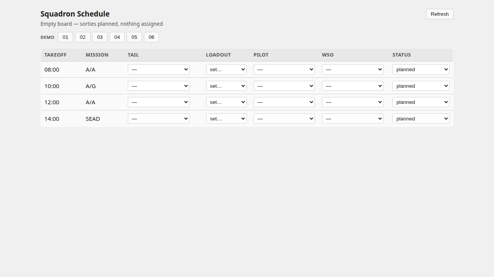
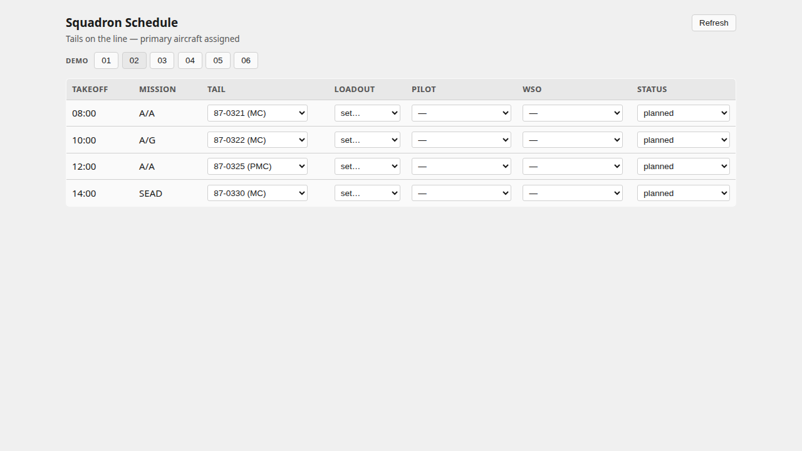
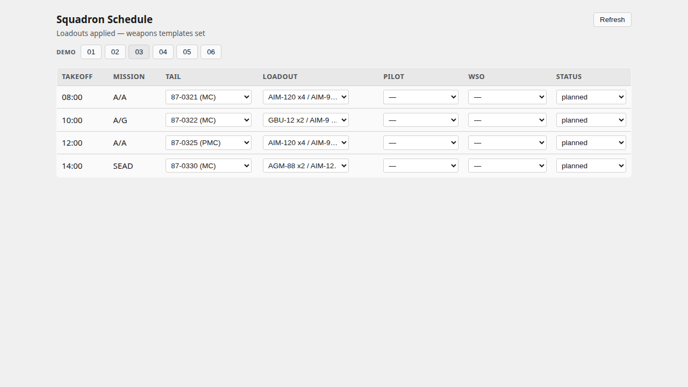
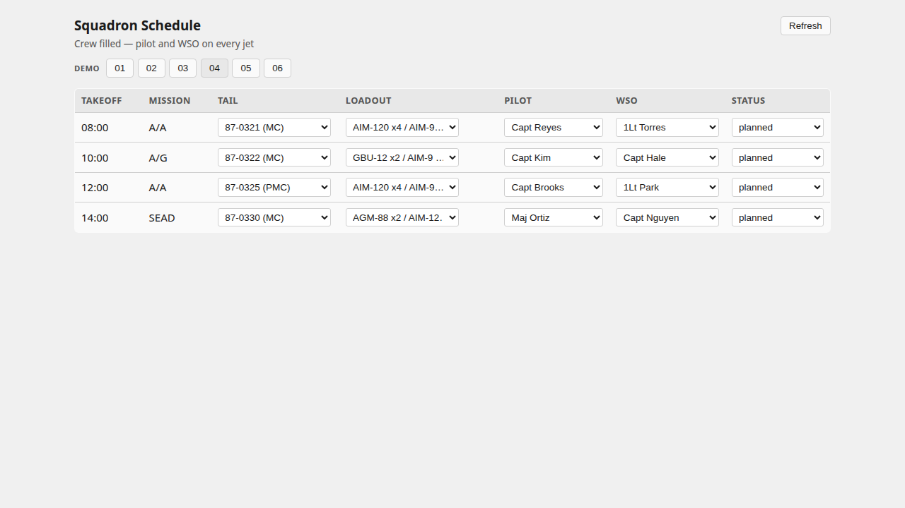
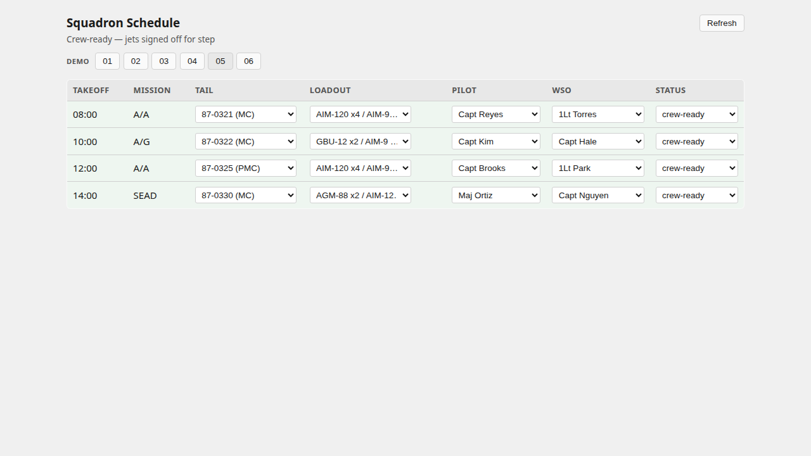
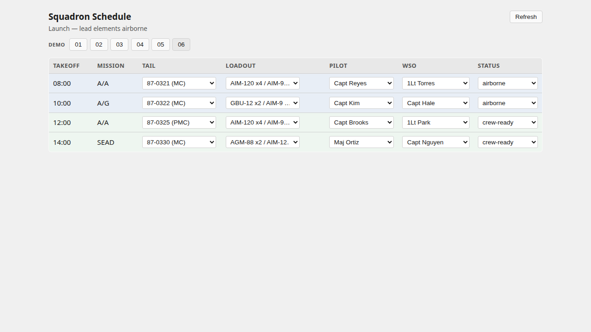
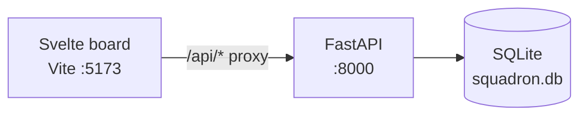
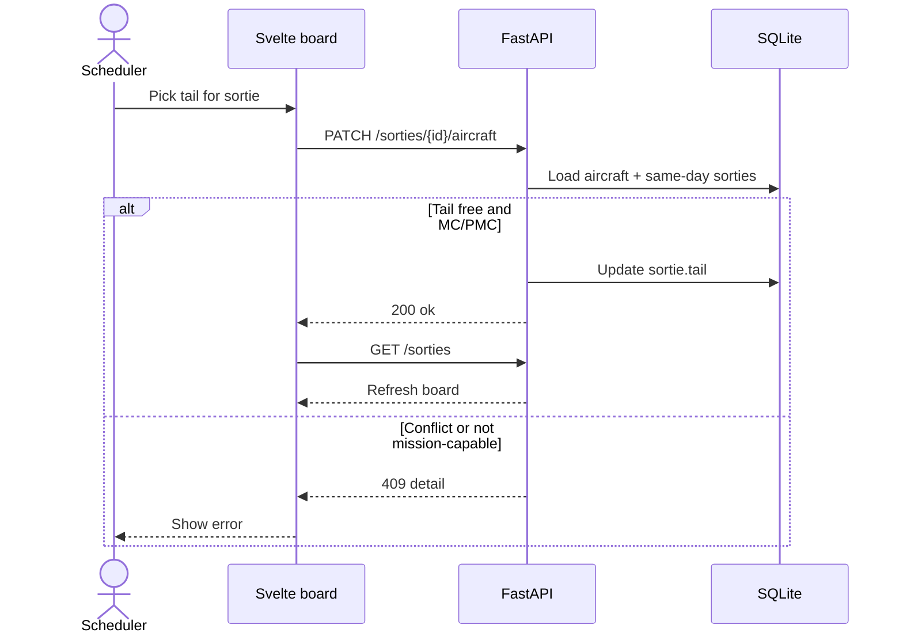

# Squadron Scheduler

Minimal squadron flying schedule board: assign **aircraft tails**, **loadout templates**, and **pilot/WSO** to sorties, with basic same-day conflict checks. Status steps: `planned` → `crew-ready` → `airborne`.

**Today:** local prototype (Svelte 5 + FastAPI + SQLite). No production deploy yet.

## Demo — morning go (build-up → launch)

Four-ship sample day (`2026-08-04`). Click **Demo 01–06** in the UI, or `POST /demo/stages/{id}`.

| Stage | What you see |
| --- | --- |
| 01 Empty board | Sorties on the schedule; nothing assigned |
| 02 Tails | Primary aircraft on each line |
| 03 Loadouts | A/A · A/G · A/A · SEAD templates |
| 04 Crew | Pilot + WSO on every jet |
| 05 Crew-ready | All four signed off for step |
| 06 Launch | Lead elements airborne |

### 01 — Empty board



### 02 — Tails assigned



### 03 — Loadouts applied



### 04 — Crew filled



### 05 — Crew-ready



### 06 — Launch



Sample data + stages: [`backend/sample_data.py`](backend/sample_data.py)  
Unit tests: `cd backend && python -m unittest test_buildup -v`  
Re-capture shots (API + UI running): `NODE_PATH=~/node_modules node scripts/capture-demo-screenshots.mjs http://127.0.0.1:5200`

## Architecture



| Layer | Role |
| --- | --- |
| `frontend/` | Schedule table + demo stage buttons |
| `backend/main.py` | Aircraft, aircrew, sorties, assignments, demo stages |
| `backend/sample_data.py` | Deterministic four-ship sample + build-up stages |
| SQLite | Seeded on first boot; demo endpoints force-reseed |

Spec & tracking: [`openspec/squadron-scheduler.feature`](openspec/squadron-scheduler.feature) · [`beads/BEADS.md`](beads/BEADS.md)

## Sequence — assign aircraft



## Remaining / planned

Shipped: view board, assign tail/loadout/crew, status to crew-ready/airborne, same-day conflicts, demo build-up + unit tests with sample data.

Not in scope yet (YAGNI): auth, real-time multi-user, rest/currency engine, load-crew estimates, Exceptional Release workflow, pen-and-ink change log, munitions inventory, AF Form 2407, Docker, production deploy, structured/OTEL logging.

## Quick start

```bash
# backend
cd backend
python -m venv .venv && source .venv/bin/activate
pip install -r requirements.txt
python main.py          # http://localhost:8000
python -m unittest test_buildup -v

# frontend (new terminal)
cd frontend
npm i
npm run dev             # http://localhost:5173  (proxies /api → :8000)
```

## Method

OpenSpec (Gherkin) → beads → ponytail implementation. Cursor health skills live under `.cursor/skills/`.
