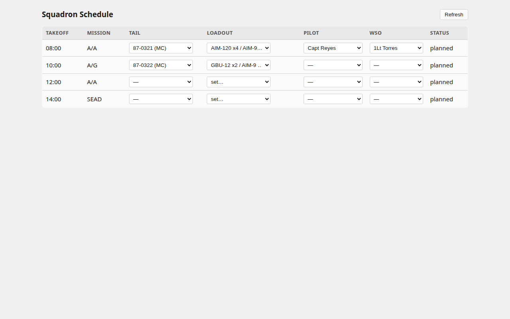
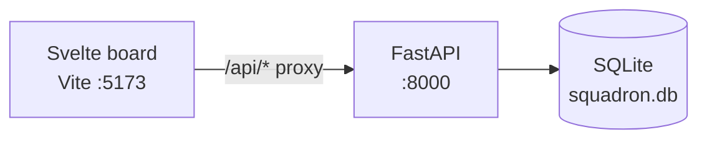
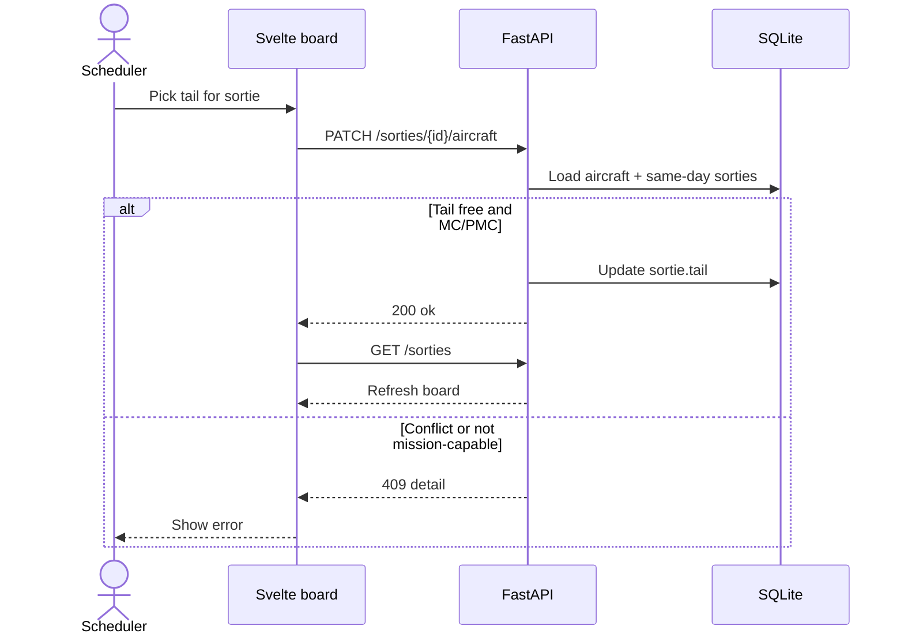

# Squadron Scheduler

Minimal squadron flying schedule board: assign **aircraft tails**, **loadout templates**, and **pilot/WSO** to sorties, with basic same-day conflict checks.

**Today:** local prototype (Svelte 5 + FastAPI + SQLite). No production deploy yet.

## Screenshot



## Architecture



| Layer | Role |
| --- | --- |
| `frontend/` | Single-page schedule table; PATCH/POST via `/api` |
| `backend/main.py` | Aircraft, aircrew, sorties, assignments + conflict rules |
| SQLite | Seeded tails, crew, and same-day sorties on first boot |

Spec & tracking: [`openspec/squadron-scheduler.feature`](openspec/squadron-scheduler.feature) · [`beads/BEADS.md`](beads/BEADS.md)

## Sequence — assign aircraft



## Remaining / planned

Shipped in this prototype: view board, assign tail, apply loadout template, assign pilot/WSO, same-day tail/crew conflict → 409.

Not in scope yet (YAGNI): auth, real-time multi-user, rest/currency engine, load-crew estimates, crew-ready / Exceptional Release workflow, pen-and-ink change log, munitions inventory, AF Form 2407, Docker, production deploy, structured/OTEL logging.

## Quick start

```bash
# backend
cd backend
python -m venv .venv && source .venv/bin/activate
pip install -r requirements.txt
python main.py          # http://localhost:8000

# frontend (new terminal)
cd frontend
npm i
npm run dev             # http://localhost:5173  (proxies /api → :8000)
```

## Method

OpenSpec (Gherkin) → beads → ponytail implementation. Cursor health skills live under `.cursor/skills/`.
