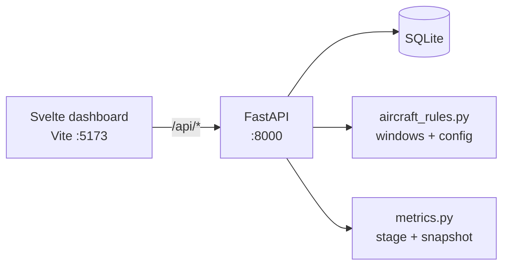

# Squadron Scheduler 2.1

Process-aware flying schedule for a squadron desk: **aircraft tails** (primary + spare), **loadouts**, **crew**, **ER**, and readiness metrics.

The primary question on the screen is **Can we generate today’s go?**  
The primary number is **executable %** (lines that are crew-ready or airborne).

**Stack:** Svelte 5 + FastAPI + SQLite  
**Method:** graham-bell prototype (OpenSpec + Gherkin + beads + tests).

## What 2.1 closed (aircraft scheduling gaps)

Critical review: [`docs/CRITICAL-REVIEW.md`](docs/CRITICAL-REVIEW.md)

| Gap | Closure |
| --- | --- |
| No land / turn windows | `land` + turn-buffer conflicts |
| No spare tail | `spare_tail` + spare ≠ primary |
| Config ignored | config mismatch blockers |
| No aircraft day view | `GET /aircraft/schedule` |
| Thin line identity | `line_number` + `callsign` |
| No load-crew estimate | minutes from template |
| Unsigned crew-ready | ER gate before crew-ready |
| Dead `rest_until` | rest gate on assign |
| Crew stuck after first assign | upsert replace + pen-and-ink |
| No change log | `GET /changes` |

## Demo — morning go (build-up → launch)

Four-ship sample day (`2026-08-04`). Click **01–06** under Replay process, or `POST /demo/stages/{id}`.

| Stage | What you see |
| --- | --- |
| 01 Empty board | Sorties planned; executable 0%; next action = missing tail |
| 02 Tails | Primary + ground spare on each line |
| 03 Loadouts | A/A · A/G · A/A · SEAD + load-crew minutes |
| 04 Crew | Pilot + WSO; still not executable (ER missing) |
| 05 Crew-ready | ER signed; executable 100% |
| 06 Launch | Lead elements airborne |

## Architecture



Spec & tracking:

- OpenSpec: [`openspec/`](openspec/) · Gherkin: [`features/`](features/)
- Beads: [`beads/BEADS.md`](beads/BEADS.md) · `bd ready`
- Workflow: [`openspec/WORKFLOW.md`](openspec/WORKFLOW.md)

## Quick start

```bash
cd backend
python -m venv .venv && source .venv/bin/activate
pip install -r requirements.txt
python main.py
python -m unittest test_metrics test_buildup -v

# frontend
cd frontend
npm i
npm run dev
```

## Remaining (production beads P1–P6)

Not in this prototype: durable multi-user store, explicit state machine, auth/tenancy, live MX feed, full RAP engine, hosted demo.
