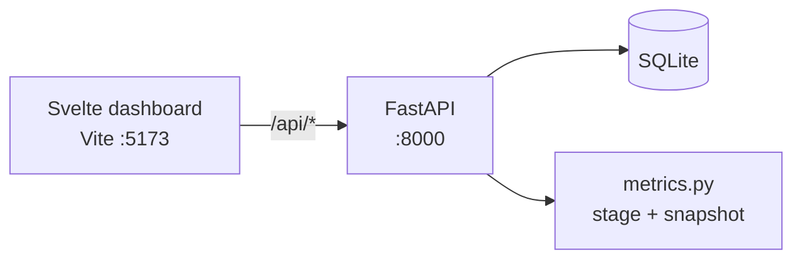

# Squadron Scheduler 2.0

Process-aware flying schedule for a squadron desk: **aircraft tails**, **loadouts**, and **crew**, with readiness metrics.

The primary question on the screen is **Can we generate today’s go?**
The primary number is **executable %** (lines that are crew-ready or airborne).

**Stack:** Svelte 5 + FastAPI + SQLite  
**Method:** graham-bell prototype (OpenSpec + Gherkin + beads + tests). Ponytail is the later compression pass, not this slice.

## What 2.0 added

- Derived process stages: planned → tail → loadout → crewed → crew-ready → airborne
- `GET /metrics` — executable %, funnel counts, next action, exceptions
- IxDF decision-first layout: question, metric band, process funnel, exception list, then the board
- See [`LEARNINGS.md`](LEARNINGS.md) and [`DEMO.md`](DEMO.md)

## Demo — morning go (build-up → launch)

Four-ship sample day (`2026-08-04`). Click **01–06** under Replay process, or `POST /demo/stages/{id}`.

| Stage | What you see |
| --- | --- |
| 01 Empty board | Sorties planned; executable 0%; next action = missing tail |
| 02 Tails | Primary aircraft on each line |
| 03 Loadouts | A/A · A/G · A/A · SEAD templates |
| 04 Crew | Pilot + WSO on every jet; still not executable |
| 05 Crew-ready | Executable 100% |
| 06 Launch | Lead elements airborne |

Sample data + stages: [`backend/sample_data.py`](backend/sample_data.py)  
Unit tests: `cd backend && python -m unittest test_metrics test_buildup -v`

## Architecture



Spec & tracking: [`openspec/squadron-scheduler.feature`](openspec/squadron-scheduler.feature) · [`beads/BEADS.md`](beads/BEADS.md)

## Quick start

```bash
cd backend
python -m venv .venv && source .venv/bin/activate
pip install -r requirements.txt
python main.py
python -m unittest test_metrics test_buildup -v

# frontend
cd frontend
npm i
npm run dev
```

## Remaining

Shipped: assignment, conflicts, demo 01–06, process stages, metrics dashboard.

Not in this prototype: auth, live MX feed, RAP/rest engine, ER signature, pen-and-ink log, hosted API. Those live as production beads P1–P8.
